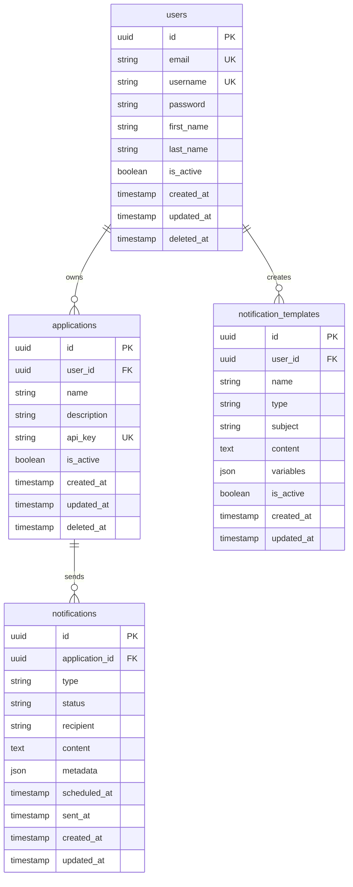
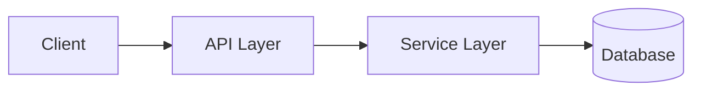

# Hermes API - System Architecture

Hermes API is a **centralized notification management system** built with Go, designed to handle multi-channel notifications (Email, SMS, Push, Webhook) for multiple applications through a unified API interface.

## �� **Core Features**

- **Multi-Channel Notifications**: Email, SMS, Push, Webhook support
- **Multi-Tenant Architecture**: Isolated per-application data and configurations
- **API Key Authentication**: Secure access for external applications
- **Role-Based Access Control**: Admin, Super Admin, Viewer roles
- **Template System**: Reusable notification templates
- **Batch Processing**: Efficient bulk notification sending
- **Queue Management**: Priority-based notification queuing
- **Real-time Status Tracking**: Notification delivery status monitoring
- **Rate Limiting**: Per-application rate limiting and burst protection

## 🏛️ **Architecture Principles**

### **Clean Architecture**
- **Separation of Concerns**: Clear boundaries between layers
- **Dependency Inversion**: High-level modules don't depend on low-level modules
- **Testability**: Each layer can be tested independently

### **Domain-Driven Design**
- **Bounded Contexts**: Clear domain boundaries
- **Aggregates**: Consistent data boundaries
- **Value Objects**: Immutable domain concepts

## 📁 **Project Structure**

| Directory | Purpose | Key Files |
|-----------|---------|-----------|
| `cmd/` | Application entry points | `rest-server/main.go` |
| `api/` | API layer implementation | `rest/controller/`, `routes.go` |
| `internal/` | Private application code | `model/`, `service/`, `repository/` |
| `pkg/` | Reusable public packages | `logger/`, `response/`, `jwt/` |
| `config/` | Configuration management | `config.go`, `config.yaml` |
| `tests/` | Test implementations | `unit/`, `integration/`, `e2e/` |
| `docs/` | Project documentation | `architecture.md` |

## 🗄️ **Database Schema**

### **Core Tables**

