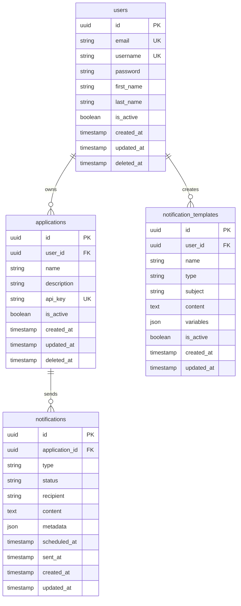
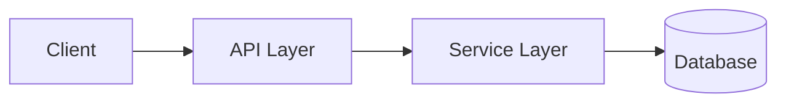
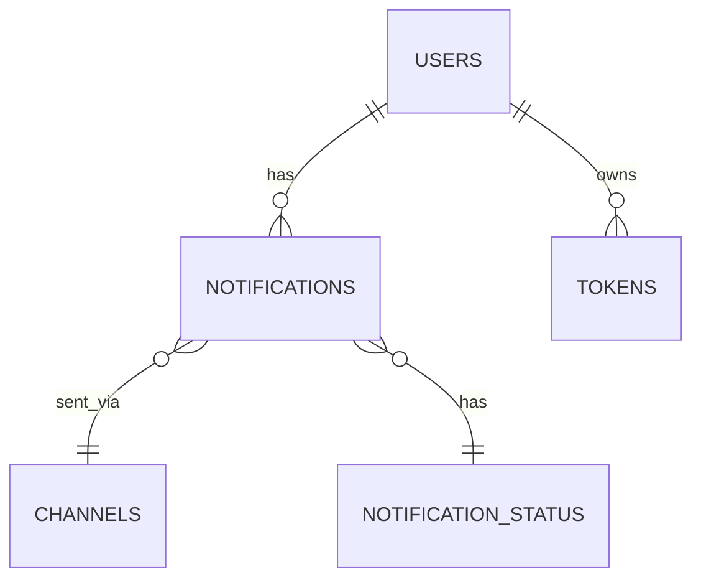

# Hermes API - System Architecture

Hermes API is a **centralized notification management system** built with Go, designed to handle multi-channel notifications (Email, SMS, Push, Webhook) for multiple applications through a unified API interface.

## 🫀 **Core Features**

- **Multi-Channel Notifications**: Email, SMS, Push, Webhook support
- **Multi-Tenant Architecture**: Isolated per-application data and configurations
- **API Key Authentication**: Secure access for external applications
- **Role-Based Access Control**: Admin, Super Admin, Viewer roles
- **Template System**: Reusable notification templates
- **Batch Processing**: Efficient bulk notification sending
- **Queue Management**: Priority-based notification queuing
- **Real-time Status Tracking**: Notification delivery status monitoring
- **Rate Limiting**: Per-application rate limiting and burst protection

## 🏛️ **Architecture Principles**

### **Clean Architecture**
- **Separation of Concerns**: Clear boundaries between layers
- **Dependency Inversion**: High-level modules don't depend on low-level modules
- **Testability**: Each layer can be tested independently

### **Domain-Driven Design**
- **Bounded Contexts**: Clear domain boundaries
- **Aggregates**: Consistent data boundaries
- **Value Objects**: Immutable domain concepts

## 📁 **Project Structure**


| Directory | Purpose | Key Files |
|-----------|---------|-----------|
| `cmd/` | Application entry points | `rest-server/main.go` |
| `api/` | API layer implementation | `rest/controller/`, `routes.go` |
| `internal/` | Private application code | `model/`, `service/`, `repository/` |
| `pkg/` | Reusable public packages | `logger/`, `response/`, `jwt/` |
| `config/` | Configuration management | `config.go`, `config.yaml` |
| `tests/` | Test implementations | `unit/`, `integration/`, `e2e/` |
| `docs/` | Project documentation | `architecture.md` |

## 🗄️ **Database Schema**

### **Core Tables**





## 🧩 Data Model Overview

Hermes uses a relational database (PostgreSQL) for persistent storage. The design follows a normalized approach to capture core domain entities such as notifications, users and channels.

### ✨ Entity Relationship Overview (Core)



## 🚀 **API Design**

### **REST API Endpoints**

#### **Authentication**

```
POST /api/v1/auth/login # User login
POST /api/v1/auth/register # User registration
POST /api/v1/auth/refresh # Refresh token
POST /api/v1/auth/logout # User logout
```

## ⚡ **Queue Architecture**

## 🛡️ **Security Features**
### **Input Validation**
- Request payload validation
- SQL injection prevention
- XSS protection
- Rate limiting per endpoint

### **Data Protection**
- Password hashing with bcrypt
- JWT token security
- API key encryption
- Database connection encryption

### **Access Control**
- Role-based permissions
- Application isolation
- Resource-level authorization
- Audit logging

## 📊 **Monitoring & Observability**
### **Logging Strategy**
- **Structured Logging**: JSON format for production
- **Log Levels**: Debug, Info, Warn, Error
- **Contextual Information**: Request ID, User ID, Application ID
- **Performance Metrics**: Response times, queue depths

### **Health Checks**
- Database connectivity
- Redis availability
- External provider status
- Queue health monitoring


## 📦 **Deployment Architecture**

### **Container Strategy**
- **Multi-stage Docker builds** for optimized images
- **Health checks** for container orchestration
- **Environment-specific configurations**
- **Secrets management** for sensitive data

### **Scaling Considerations**
- **Horizontal scaling** of API servers
- **Queue worker scaling** based on load
- **Database read replicas** for read-heavy operations
- **CDN integration** for static assets

## 🔧 **Development Workflow**

### **Code Organization**
- **Clean Architecture** principles
- **Interface-driven development**
- **Dependency injection**
- **Comprehensive testing**

### **Quality Assurance**
- **Unit tests** for business logic
- **Integration tests** for API endpoints
- **End-to-end tests** for critical flows
- **Code coverage** requirements

## 📈 **Performance Considerations**

### **Optimization Strategies**
- **Connection pooling** for database and Redis
- **Batch processing** for bulk operations
- **Caching** for frequently accessed data
- **Async processing** for non-critical operations

### **Scalability Patterns**
- **Microservices ready** architecture
- **Event-driven** communication
- **Stateless** API design
- **Horizontal scaling** support

## 🔮 **Future Enhancements**

### **Planned Features**
- **gRPC API** for high-performance communication
- **GraphQL API** for flexible data querying
- **Event-driven notifications** based on user actions
- **Advanced analytics** and reporting
- **Multi-language SDKs** for easier integration

### **Architecture Evolution**
- **Microservices migration** for better scalability
- **Event sourcing** for audit trails
- **CQRS pattern** for read/write separation
- **Service mesh** for inter-service communication